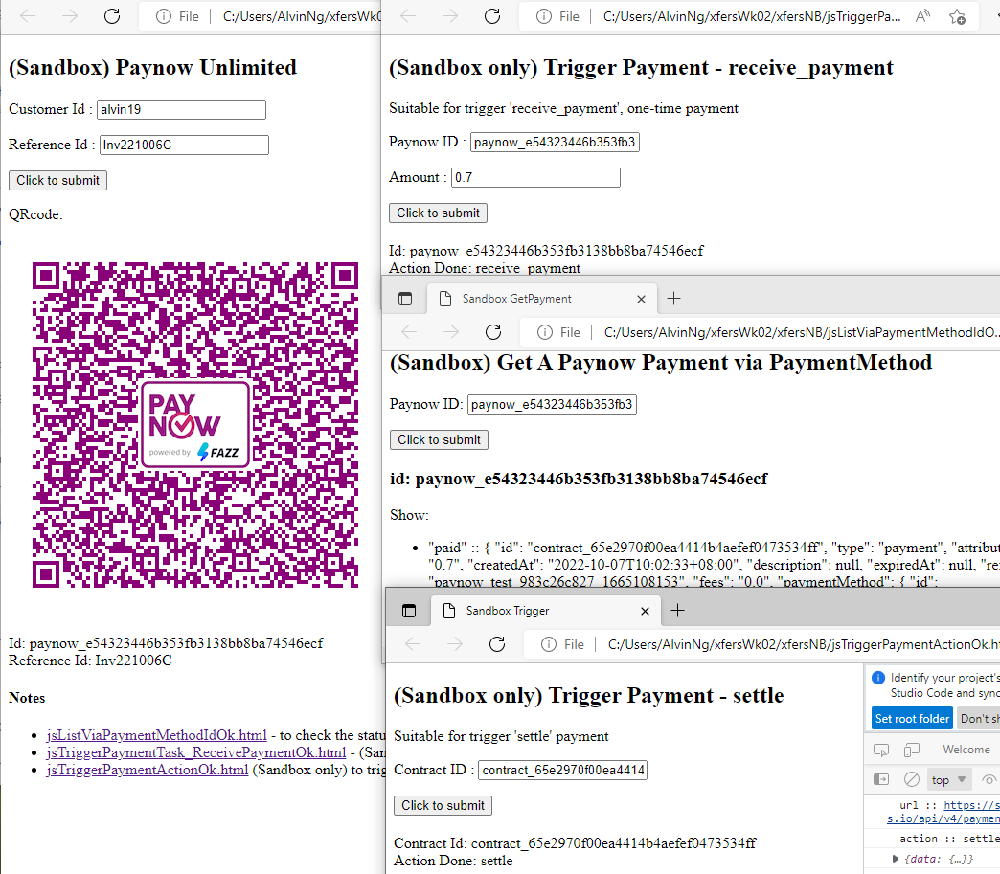

### cURL, JsFetch

- Base64StringToPngImage.html - Generate image qrcode using existing **base64String**
- webhook1.md - cURL from **Webhook** dashboard, such as retrive json, token detail, retreat latest, retreat single raw
- jsSandboxGetAOneTimePaymentOk.html - basic sample, from **Fazz's Postman collection** output **json** to developer console
- jsSandboxPaynowFinal.html - generate one-time **paynow qrcode**, after input amount, referenceId
- jsListAllPaymentR1.html - list all types of payments, such as `pending`,``paid`, `complete`, `expired`
- jsListAllPaymentR2UserPass.html - Input **API_KEY** and **SECRET_KEY** to generate **base64** String.
- *jsSandboxListSelectedPaymentOk.html* - list all json according checkbox **`pending`,`paid`, `complete`, `expired`**
- jsGetAPaymentViaContractidOk.html - get payment status via input `contractId`
- jsGetQRcodeViaPaymentMethod.html - get paynow qrCode image and `referenceId` via input paynow Id
- jsSandboxPaynowFinal.html - get paynow qrCode via input `amount`, and `referenceId`

#### qrcode > payment > settle
- 221007jsPaynowToSettle.png - see below image of `jsSandboxPaynow_UnlimitedOk.html`, 
                                                  `jsTriggerPaymentTask_ReceivePaymentOk.html>`, 
                                                  `jsListViaPaymentMethodIdOk.html`, `jsTriggerPaymentActionOk.html`
- jsSandboxPaynow_UnlimitedOk.html - **paynow qrCode** image, contractId, referenceId, status via input amount and id
- jsTriggerPaymentTask_ReceivePaymentOk.html -  to trigger `receive_payment` via input paynow Id
- jsListViaPaymentMethodIdOk.html           - List all payments
- jsTriggerPaymentAction.html - **KIV** trigger **settle** payment with fixed contractId.

---
